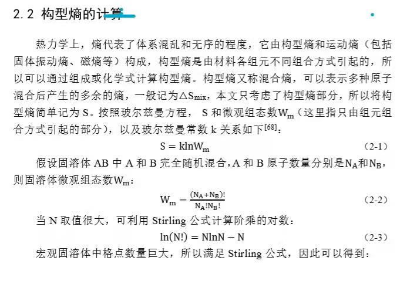
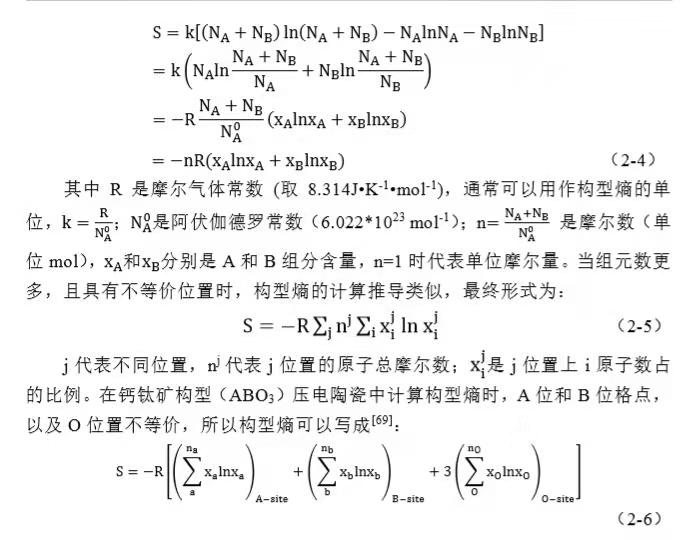
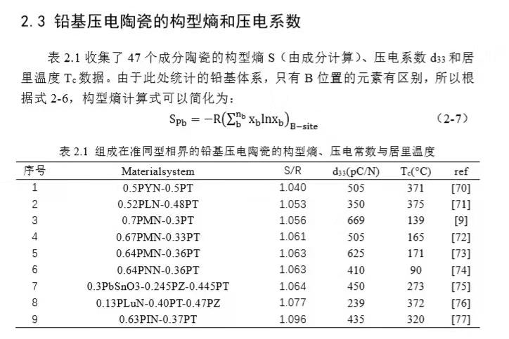
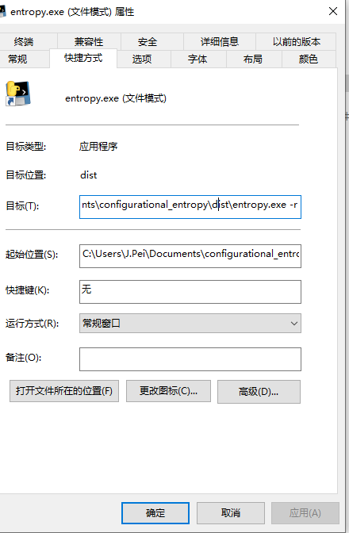

[TOC]

# Entropy

## 程序简介

本程序采用python3编写，具体用到的第三方库有numpy, scipy, pandas。如有问题，及时联系J.Pei(J.Pei@foxmail.com)。

本程序源代码托管在github上面，如需要查看最新版本程序，请移步至: https://github.com/13skeleton/config-entropy

## 程序原理









## 程序运行方式

### Windows环境

#### 交互模式(默认)

- 单击“entropy.exe”，即可自动运行

  > 根据程序，回答几个问题，即可计算出构型熵

#### 文件模式

- 右击“entropy.exe”，创建快捷方式
- 右击“entropy.exe”的快捷方式，选择属性，在目标栏最后加入`-r`，如下图所示。



- 准备好“mat.in”文件
- 双击“entropy.exe”快捷方式

> 只有首次运行需要创建快捷方式，后续运行程序直接双击快捷方式即可。

#### 获取帮助信息

```
entropy.exe -h
```

### linux环境

#### 交互模式(默认)

```
entropy_linux -i
```

> 其中`-i`可省略。

#### 文件模式

1. 在当前文件夹下准备”mat.in“文件
2. 运行以下命令

```
entropy_linux -r
```

>  其中`-r`表示启用文件模式，不可省略。

#### 获取帮助信息

```
entropy_linux -h
```


## “mat.in”文件介绍

mat.in 文件如下:

```
Yb Nb Ti #位置1存在的化学元素
0.25 0.25 0.5 #三种元素的摩尔量

Pb  #位置2存在的化学元素
1   #对应元素的摩尔量

O	#位置3存在的化学元素
3   # 对应元素的摩尔量
```

> 1. 行首加入”#“，表示注释，信息不录入程序中
>
> 2. 空行不录入程序中
> 3. 摩尔量，元素符号之间用空格隔开